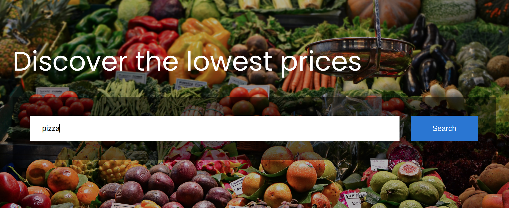
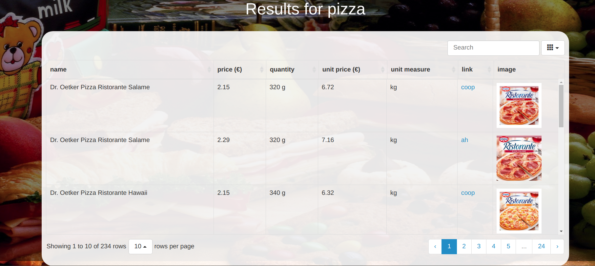
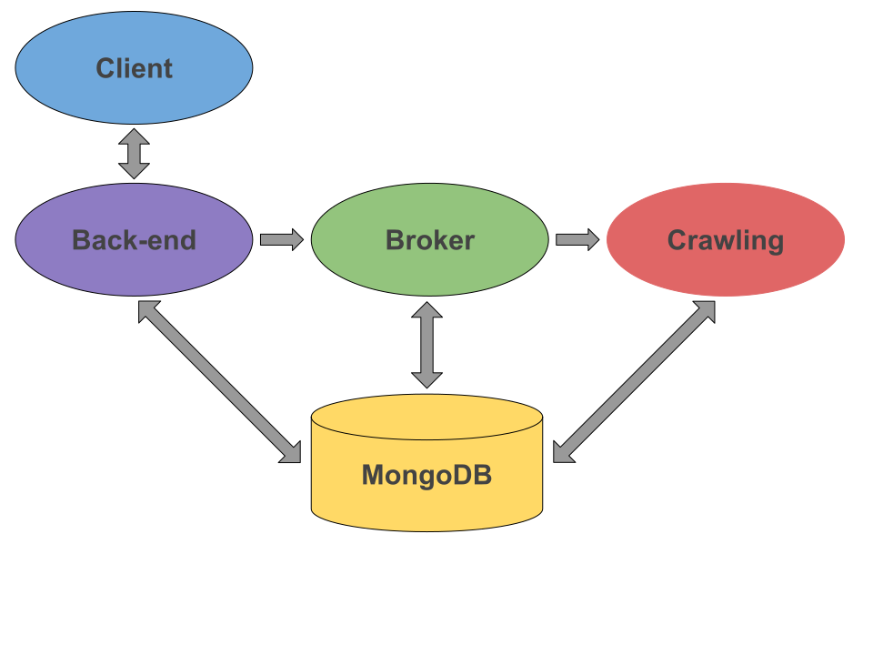

Shopping web scraper: scrapes products from different supermarkets, processes
and organizes the results, sorts the results as requested by the user.

A personal project to learn some tools such as `scrapy`, `MongoDB`, 
`Redis`, `Docker` and `flask`.

## Usage

Shop scraper is delivered with `docker` and good to go with `docker-compose`:
```bash
> docker-compose up
```

If you need to remove all the old images containers, and build new ones, start
the app by running the script:
```bash
> ./run.sh
```

## Interface

When the app is up and running, you can open the webapp from browser, 
from `0.0.0.0:5000`.

There you will find the search page:



Digit the search term and press `Search` to see the results page:



Here you can see the results from different supermarkets in a single table,
with product name, shop price, unit price and unit measure, image and
a link to the shop.

All the columns are sortable (except the 'image' column), and there is a search
bar where you can search for a particular product.

## Architecture

The project is composed of different units, each of them is a docker container
(except `Client` and `Back-end` units which are placed in a single container).
The communication is done by using message-passing through `redis` over docker
networks.



## Repo organization

  - `client`: `flask` client and backend
  - `broker`: a broker which receives search requests for a given search term
    and, if there are no recent products in the db for the given term, forwards
    the search term to one of the crawlers
  - `crawling`: crawling of products from web shops, their processing and
    insertion into the db
  - `data_collections`: database schema definition
  - `data_processing`: useful code to make products comparisons, e.g., to check
    if two products are the same, or to normalize product measure units and
    quantities
